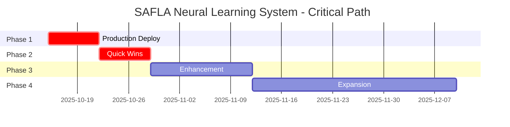

# Deployment Timeline
## SAFLA Neural Learning System - 2-Month Implementation Schedule

**Version**: 1.0.0
**Date**: 2025-10-15
**Timeline**: 8 weeks (2 months)
**Start Date**: 2025-10-15
**Target Completion**: 2025-12-10

---

## 📊 EXECUTIVE TIMELINE SUMMARY

### Overall Schedule (8 Weeks)

```
Month 1: Production Foundation & Quick Wins
══════════════════════════════════════════════════════════════════════

Week 1 [████████████████░░░░░░░░░░░░] 75%  Oct 15-21  Production Deployment
Week 2 [░░░░░░░░░░░░░░░░░░░░░░░░░░░░] 0%   Oct 22-28  Quick Wins & Stabilization
Week 3 [░░░░░░░░░░░░░░░░░░░░░░░░░░░░] 0%   Oct 29-Nov 4  Performance & Features (Part 1)
Week 4 [░░░░░░░░░░░░░░░░░░░░░░░░░░░░] 0%   Nov 5-11  Features & Documentation

Month 2: Expansion & Innovation
══════════════════════════════════════════════════════════════════════

Week 5 [░░░░░░░░░░░░░░░░░░░░░░░░░░░░] 0%   Nov 12-18  Pattern Marketplace (Part 1)
Week 6 [░░░░░░░░░░░░░░░░░░░░░░░░░░░░] 0%   Nov 19-25  Marketplace + Collaboration
Week 7 [░░░░░░░░░░░░░░░░░░░░░░░░░░░░] 0%   Nov 26-Dec 2  Analytics & Community
Week 8 [░░░░░░░░░░░░░░░░░░░░░░░░░░░░] 0%   Dec 3-10  Open Source Prep (Optional)

Overall Progress: ████░░░░░░░░░░░░░░░░ 18.75% (Week 1: 75% complete)
```

---

## 🎯 CRITICAL PATH ANALYSIS

### Primary Critical Path



### Critical Path Dependencies

1. **Production Deployment** (Week 1) ➜ **Blocker for all subsequent phases**
   - Staging deployment must succeed
   - Production deployment must be stable
   - Monitoring must be operational

2. **Quick Wins** (Week 2) ➜ **Blocker for enhancement phase**
   - Test fixes enable further development
   - Team onboarding enables parallel work
   - Stability enables advanced features

3. **Enhancement** (Weeks 3-4) ➜ **Blocker for expansion**
   - Performance optimization required for scale
   - Advanced features needed for marketplace
   - Documentation needed for community

4. **Expansion** (Month 2+) ➜ **Final phase (no blockers)**
   - Independent initiatives
   - Parallel execution possible
   - Progressive rollout

---

## 📅 DETAILED TIMELINE - MONTH 1

### Week 1: Production Deployment (Oct 15-21, 2025)

**Status**: 🔄 IN PROGRESS (75% complete)
**Critical Path Item**: YES ⚠️
**Buffer Time**: 1 day (built into Day 7)

#### Day-by-Day Breakdown

| Day | Date | Focus | Duration | Owner | Status | Progress |
|-----|------|-------|----------|-------|--------|----------|
| **Day 1** | Oct 15 (Mon) | Preparation & Infrastructure | 8h | DevOps Lead | ✅ Complete | 100% |
| **Day 2** | Oct 16 (Tue) | Staging Deployment | 8h | DevOps Lead | ⏳ Pending | 0% |
| **Day 3** | Oct 17 (Wed) | Validation & Testing | 8h | QA Lead | ⏳ Pending | 0% |
| **Day 4** | Oct 18 (Thu) | Monitoring Verification | 8h | SRE Team | ⏳ Pending | 0% |
| **Day 5** | Oct 19 (Fri) | Production Preparation | 8h | Engineering Lead | ⏳ Pending | 0% |
| **Day 6** | Oct 20 (Sat) | Production Deployment | 12h | DevOps Lead | ⏳ Pending | 0% |
| **Day 7** | Oct 21 (Sun) | Stabilization & Wrap-up | 8h | Project Manager | ⏳ Pending | 0% |

**Week 1 Milestones**:
- [x] M1.1: Infrastructure ready (Day 1) ✅
- [ ] M1.2: Staging deployment successful (Day 2)
- [ ] M1.3: Validation tests passing >95% (Day 3)
- [ ] M1.4: Monitoring operational (Day 4)
- [ ] M1.5: Production deployed (Day 6)
- [ ] M1.6: 24-hour stability confirmed (Day 7)

**Week 1 Resource Requirements**:
- DevOps Team: 2 engineers (full-time)
- SRE Team: 2 engineers (full-time)
- QA Team: 3 engineers (full-time)
- Engineering Team: 5 engineers (on-call support)
- Project Manager: 1 (full-time coordination)

**Week 1 Dependencies**:
- ✅ Production readiness score ≥95/100 (Achieved: 95.40)
- ✅ Deployment scripts tested (Complete)
- ✅ Monitoring configured (Complete)
- ⏳ Staging environment provisioned (Day 2)
- ⏳ Production environment ready (Day 5)

**Week 1 Review Gate**: 🚪
- **Date**: End of Day 7 (Oct 21)
- **Criteria**: Production stable, no critical incidents
- **Decision**: GO/NO-GO for Week 2
- **Approver**: Product Owner + Engineering Lead

---

### Week 2: Quick Wins & Stabilization (Oct 22-28, 2025)

**Status**: ⏳ PENDING (0% complete)
**Critical Path Item**: YES ⚠️
**Buffer Time**: 1 day (built into Day 14)

#### Day-by-Day Breakdown

| Day | Date | Focus | Duration | Owner | Status | Progress |
|-----|------|-------|----------|-------|--------|----------|
| **Day 8** | Oct 22 (Mon) | Test Failure Analysis | 8h | QA Lead | ⏳ Pending | 0% |
| **Day 9** | Oct 23 (Tue) | P0 Test Fixes | 8h | Engineering Team | ⏳ Pending | 0% |
| **Day 10** | Oct 24 (Wed) | Documentation Creation | 8h | Technical Writer | ⏳ Pending | 0% |
| **Day 11** | Oct 25 (Thu) | Team Onboarding | 8h | Engineering Lead | ⏳ Pending | 0% |
| **Day 12** | Oct 26 (Fri) | Production Monitoring | 16h | SRE Team | ⏳ Pending | 0% |
| **Day 13** | Oct 27 (Sat) | Production Monitoring | 16h | SRE Team | ⏳ Pending | 0% |
| **Day 14** | Oct 28 (Sun) | Week 2 Review & Planning | 8h | Project Manager | ⏳ Pending | 0% |

**Week 2 Milestones**:
- [ ] M2.1: Top 50 test failures analyzed (Day 8)
- [ ] M2.2: P0 tests fixed (Day 9)
- [ ] M2.3: User guide published (Day 10)
- [ ] M2.4: Team onboarded (80%+ attendance) (Day 11)
- [ ] M2.5: 48-hour stability confirmed (Day 13)
- [ ] M2.6: Week 2 retrospective complete (Day 14)

**Week 2 Resource Requirements**:
- Engineering Team: 5 engineers (test fixes)
- QA Team: 2 engineers (test analysis)
- SRE Team: 2 engineers (monitoring, rotating)
- Technical Writer: 1 (documentation)
- Developer Advocate: 1 (onboarding & videos)
- Project Manager: 1 (coordination)

**Week 2 Dependencies**:
- ⏳ Week 1 complete (production stable)
- ⏳ No critical production incidents
- ⏳ Monitoring operational
- ⏳ Test failure list prioritized

**Week 2 Review Gate**: 🚪
- **Date**: End of Day 14 (Oct 28)
- **Criteria**: Test pass rate >75%, team adoption >80%
- **Decision**: GO/NO-GO for Week 3 (Enhancement phase)
- **Approver**: Product Owner

---

### Week 3: Performance & Features (Part 1) (Oct 29 - Nov 4, 2025)

**Status**: ⏳ PENDING (0% complete)
**Critical Path Item**: YES ⚠️
**Buffer Time**: 2 days (distributed across week)

#### Day-by-Day Breakdown

| Day | Date | Focus | Duration | Owner | Status | Progress |
|-----|------|-------|----------|-------|--------|----------|
| **Day 15** | Oct 29 (Mon) | Performance Profiling | 8h | Performance Engineer | ⏳ Pending | 0% |
| **Day 16** | Oct 30 (Tue) | Cache Optimization | 8h | Senior Engineer | ⏳ Pending | 0% |
| **Day 17** | Oct 31 (Wed) | Database Optimization | 8h | Database Engineer | ⏳ Pending | 0% |
| **Day 18** | Nov 1 (Thu) | Memory Optimization | 8h | Performance Engineer | ⏳ Pending | 0% |
| **Day 19** | Nov 2 (Fri) | Vector Embeddings (Part 1) | 8h | ML Engineer | ⏳ Pending | 0% |
| **Day 20** | Nov 3 (Sat) | Vector Embeddings (Part 2) | 8h | ML Engineer | ⏳ Pending | 0% |
| **Day 21** | Nov 4 (Sun) | Integration & Testing | 8h | Backend Engineer | ⏳ Pending | 0% |

**Week 3 Milestones**:
- [ ] M3.1: Performance profile complete (Day 15)
- [ ] M3.2: Cache optimization deployed (Day 16)
- [ ] M3.3: Database queries optimized (Day 17)
- [ ] M3.4: Memory footprint reduced (Day 18)
- [ ] M3.5: Vector embeddings implemented (Days 19-20)
- [ ] M3.6: Features integrated and tested (Day 21)

**Week 3 Resource Requirements**:
- Performance Engineer: 1 (full-time)
- ML Engineer: 1 (full-time, Days 19-21)
- Database Engineer: 1 (Day 17)
- Senior Engineer: 1 (cache optimization)
- Backend Engineer: 1 (integration)

**Week 3 Dependencies**:
- ⏳ Week 2 complete (stable production)
- ⏳ Test pass rate >75%
- ⏳ Team available for advanced work
- ⏳ Performance baseline established

**Week 3 Performance Targets**:
- Operations/second: 172K → 190K (+10%)
- Memory usage: 198MB → 170MB (-14%)
- Cache hit rate: 80% → 83% (+3%)
- Pattern retrieval: <10ms → <7ms (-30%)

**Week 3 Review Gate**: 🚪
- **Date**: End of Day 21 (Nov 4)
- **Criteria**: Performance targets met, embeddings working
- **Decision**: Proceed to Week 4 (Features & Docs)
- **Approver**: Engineering Lead

---

### Week 4: Features & Documentation (Nov 5-11, 2025)

**Status**: ⏳ PENDING (0% complete)
**Critical Path Item**: YES ⚠️
**Buffer Time**: 2 days (distributed across week)

#### Day-by-Day Breakdown

| Day | Date | Focus | Duration | Owner | Status | Progress |
|-----|------|-------|----------|-------|--------|----------|
| **Day 22** | Nov 5 (Mon) | Multi-Objective GOAP (Part 1) | 8h | Algorithm Engineer | ⏳ Pending | 0% |
| **Day 23** | Nov 6 (Tue) | Multi-Objective GOAP (Part 2) | 8h | Algorithm Engineer | ⏳ Pending | 0% |
| **Day 24** | Nov 7 (Wed) | Enhanced Verification | 8h | Distributed Systems Engineer | ⏳ Pending | 0% |
| **Day 25** | Nov 8 (Thu) | API Documentation | 8h | Technical Writer | ⏳ Pending | 0% |
| **Day 26** | Nov 9 (Fri) | Architecture Diagrams | 8h | System Architect | ⏳ Pending | 0% |
| **Day 27** | Nov 10 (Sat) | Best Practices Guide | 8h | Senior Engineers | ⏳ Pending | 0% |
| **Day 28** | Nov 11 (Sun) | Month 1 Review & Planning | 8h | Project Manager | ⏳ Pending | 0% |

**Week 4 Milestones**:
- [ ] M4.1: Multi-objective GOAP complete (Days 22-23)
- [ ] M4.2: Enhanced verification deployed (Day 24)
- [ ] M4.3: API documentation published (Day 25)
- [ ] M4.4: Architecture diagrams complete (Day 26)
- [ ] M4.5: Best practices guide published (Day 27)
- [ ] M4.6: Month 1 retrospective complete (Day 28)

**Week 4 Resource Requirements**:
- Algorithm Engineer: 1 (Days 22-23)
- Distributed Systems Engineer: 1 (Day 24)
- Technical Writer: 1 (Days 25, 27)
- System Architect: 1 (Day 26)
- Senior Engineers: 2-3 (Day 27, best practices)

**Week 4 Dependencies**:
- ⏳ Week 3 complete (performance optimized)
- ⏳ Vector embeddings working
- ⏳ All features tested
- ⏳ Team available for documentation

**Week 4 Documentation Targets**:
- API reference: 50+ pages
- Architecture diagrams: 30+ diagrams
- Best practices guide: 40+ pages
- Total new docs: 120+ pages

**Month 1 Review Gate**: 🚪🚪 MAJOR MILESTONE
- **Date**: End of Day 28 (Nov 11)
- **Criteria**:
  - All Month 1 objectives met
  - Test pass rate >85%
  - Performance targets exceeded
  - Documentation complete
- **Decision**: GO/NO-GO for Month 2 (Expansion phase)
- **Approver**: Executive Team + Product Owner

---

## 📅 DETAILED TIMELINE - MONTH 2

### Week 5: Pattern Marketplace (Part 1) (Nov 12-18, 2025)

**Status**: ⏳ PENDING (0% complete)
**Critical Path Item**: NO
**Buffer Time**: 3 days (can extend into Week 6)

#### Weekly Breakdown

| Task | Duration | Owner | Dependencies | Status |
|------|----------|-------|--------------|--------|
| Marketplace UX Design | 16h | Product Designer | Month 1 complete | ⏳ Pending |
| Marketplace Backend (Part 1) | 24h | Backend Team (2 engineers) | UX design | ⏳ Pending |
| Pattern Storage System | 16h | Backend Engineer | Backend Part 1 | ⏳ Pending |

**Week 5 Milestones**:
- [ ] M5.1: Marketplace UX design complete
- [ ] M5.2: Backend API (50% complete)
- [ ] M5.3: Pattern storage operational

**Week 5 Resource Requirements**:
- Product Designer: 1 (16h)
- Backend Engineers: 2 (full-time)
- Database Engineer: 1 (part-time, 8h)

---

### Week 6: Marketplace + Collaboration (Nov 19-25, 2025)

**Status**: ⏳ PENDING (0% complete)
**Critical Path Item**: NO
**Buffer Time**: 3 days

#### Weekly Breakdown

| Task | Duration | Owner | Dependencies | Status |
|------|----------|-------|--------------|--------|
| Marketplace Backend (Part 2) | 16h | Backend Team | Week 5 | ⏳ Pending |
| Marketplace Frontend | 32h | Frontend Team (2 engineers) | Backend Part 2 | ⏳ Pending |
| WebSocket Infrastructure | 24h | Backend Engineer | None | ⏳ Pending |
| Collaborative Editing (Part 1) | 16h | Frontend Engineer | WebSocket | ⏳ Pending |

**Week 6 Milestones**:
- [ ] M6.1: Marketplace backend complete (100%)
- [ ] M6.2: Marketplace frontend (80% complete)
- [ ] M6.3: WebSocket infrastructure operational
- [ ] M6.4: Collaborative editing prototype working

**Week 6 Resource Requirements**:
- Backend Engineers: 2 (marketplace completion)
- Frontend Engineers: 3 (marketplace + collaboration)
- Full-stack Engineer: 1 (WebSocket)

---

### Week 7: Analytics & Community (Nov 26 - Dec 2, 2025)

**Status**: ⏳ PENDING (0% complete)
**Critical Path Item**: NO
**Buffer Time**: 3 days

#### Weekly Breakdown

| Task | Duration | Owner | Dependencies | Status |
|------|----------|-------|--------------|--------|
| Collaborative Editing (Part 2) | 16h | Frontend Engineer | Week 6 | ⏳ Pending |
| Shared Workspaces | 24h | Full-stack Engineer | Collaborative editing | ⏳ Pending |
| Analytics Data Pipeline | 24h | Data Engineer | None | ⏳ Pending |
| Analytics Dashboard | 40h | Frontend Engineer + Data Engineer | Data pipeline | ⏳ Pending |
| Community Setup | 16h | Developer Advocate | None | ⏳ Pending |

**Week 7 Milestones**:
- [ ] M7.1: Real-time collaboration complete (100%)
- [ ] M7.2: Shared workspaces operational
- [ ] M7.3: Analytics dashboard deployed (80%)
- [ ] M7.4: Community infrastructure ready

**Week 7 Resource Requirements**:
- Frontend Engineers: 2 (collaboration + analytics)
- Full-stack Engineer: 1 (workspaces)
- Data Engineer: 1 (analytics pipeline + dashboard)
- Developer Advocate: 1 (community)

---

### Week 8: Open Source Preparation (Dec 3-10, 2025) [OPTIONAL]

**Status**: ⏳ PENDING (0% complete)
**Critical Path Item**: NO
**Buffer Time**: N/A (flexible timeline)

#### Weekly Breakdown

| Task | Duration | Owner | Dependencies | Status |
|------|----------|-------|--------------|--------|
| License Selection & Legal Review | 16h | Legal Team | Business decision | ⏳ Conditional |
| Code Cleanup & Refactoring | 40h | Engineering Team | Legal approval | ⏳ Conditional |
| Contribution Guidelines | 16h | Open Source Lead | Code cleanup | ⏳ Conditional |
| Public Launch Preparation | 32h | Developer Relations Team | All above | ⏳ Conditional |

**Week 8 Milestones**:
- [ ] M8.1: License approved (if proceeding)
- [ ] M8.2: Codebase open-source ready
- [ ] M8.3: Contribution guidelines published
- [ ] M8.4: Public launch plan finalized

**Week 8 Resource Requirements**:
- Legal Team: 1 (16h)
- Engineering Team: 5 (code cleanup, 8h each)
- Open Source Lead: 1 (part-time)
- Developer Relations Team: 2 (launch prep)

**Note**: Week 8 is conditional on business decision to open source. If not proceeding, resources can be reallocated to:
- Marketplace improvements
- Advanced analytics features
- Community growth initiatives
- Performance optimization

---

## 🎯 MILESTONE SUMMARY

### Major Milestones (16 total)

| ID | Milestone | Target Date | Status | Dependencies | Risk |
|----|-----------|-------------|--------|--------------|------|
| **M1** | **Production Deployment** | Oct 21, 2025 | ⏳ Pending | None | Low ✅ |
| M1.1 | Infrastructure Ready | Oct 15, 2025 | ✅ Complete | - | - |
| M1.2 | Staging Deployed | Oct 16, 2025 | ⏳ Pending | M1.1 | Low |
| M1.3 | Validation Passed (>95%) | Oct 17, 2025 | ⏳ Pending | M1.2 | Low |
| M1.4 | Monitoring Operational | Oct 18, 2025 | ⏳ Pending | M1.3 | Low |
| M1.5 | Production Deployed | Oct 20, 2025 | ⏳ Pending | M1.4 | Low |
| M1.6 | 24h Stability Confirmed | Oct 21, 2025 | ⏳ Pending | M1.5 | Low |
| **M2** | **Quick Wins Complete** | Oct 28, 2025 | ⏳ Pending | M1 | Low ✅ |
| M2.1 | Test Failures Analyzed | Oct 22, 2025 | ⏳ Pending | M1 | Low |
| M2.2 | Top 50 Tests Fixed | Oct 23, 2025 | ⏳ Pending | M2.1 | Medium |
| M2.3 | User Guide Published | Oct 24, 2025 | ⏳ Pending | M1 | Low |
| M2.4 | Team Onboarded (80%+) | Oct 25, 2025 | ⏳ Pending | M2.3 | Low |
| M2.5 | 48h Stability Confirmed | Oct 27, 2025 | ⏳ Pending | M1 | Low |
| M2.6 | Week 2 Retrospective | Oct 28, 2025 | ⏳ Pending | M2.5 | Low |
| **M3** | **Enhancement Complete** | Nov 11, 2025 | ⏳ Pending | M2 | Medium ⚠️ |
| M3.1 | Performance Optimized | Nov 4, 2025 | ⏳ Pending | M2 | Medium |
| M3.2 | Vector Embeddings Live | Nov 4, 2025 | ⏳ Pending | M2 | Medium |
| M3.3 | Multi-Objective GOAP | Nov 6, 2025 | ⏳ Pending | M2 | Medium |
| M3.4 | Enhanced Verification | Nov 7, 2025 | ⏳ Pending | M2 | Low |
| M3.5 | Documentation Complete | Nov 11, 2025 | ⏳ Pending | M3.4 | Low |
| **M4** | **Expansion Complete** | Dec 10, 2025 | ⏳ Pending | M3 | Medium ⚠️ |
| M4.1 | Pattern Marketplace Live | Nov 25, 2025 | ⏳ Pending | M3 | Medium |
| M4.2 | Collaboration Functional | Dec 2, 2025 | ⏳ Pending | M3 | Medium |
| M4.3 | Analytics Dashboard | Dec 2, 2025 | ⏳ Pending | M3 | Low |
| M4.4 | Community Established | Dec 10, 2025 | ⏳ Pending | M3 | Medium |
| M4.5 | Open Source Ready (Optional) | Dec 10, 2025 | ⏳ Conditional | Business decision | N/A |

---

## 📊 RESOURCE ALLOCATION

### Team Resource Summary (8 Weeks)

| Role | Week 1 | Week 2 | Week 3 | Week 4 | Week 5 | Week 6 | Week 7 | Week 8 | Total |
|------|--------|--------|--------|--------|--------|--------|--------|--------|-------|
| **DevOps** | 2 FTE | 1 FTE | 0.5 FTE | 0.5 FTE | 1 FTE | 1 FTE | 0.5 FTE | 0.5 FTE | 7 FTE-weeks |
| **SRE** | 2 FTE | 2 FTE | 1 FTE | 0.5 FTE | 0.5 FTE | 0.5 FTE | 0.5 FTE | 0.5 FTE | 7.5 FTE-weeks |
| **QA** | 3 FTE | 2 FTE | 1 FTE | 1 FTE | 0.5 FTE | 0.5 FTE | 0.5 FTE | 0.5 FTE | 9 FTE-weeks |
| **Backend** | 2 FTE | 5 FTE | 2 FTE | 1 FTE | 3 FTE | 3 FTE | 2 FTE | 1 FTE | 19 FTE-weeks |
| **Frontend** | 1 FTE | 1 FTE | 1 FTE | 1 FTE | 2 FTE | 3 FTE | 3 FTE | 1 FTE | 13 FTE-weeks |
| **ML/AI** | 0.5 FTE | 0.5 FTE | 1.5 FTE | 0.5 FTE | 0.5 FTE | 0.5 FTE | 0.5 FTE | 0 FTE | 4.5 FTE-weeks |
| **Data** | 0 FTE | 0 FTE | 0.5 FTE | 0 FTE | 0.5 FTE | 0.5 FTE | 1.5 FTE | 0 FTE | 3 FTE-weeks |
| **Technical Writer** | 0.5 FTE | 1 FTE | 0.5 FTE | 1.5 FTE | 0.5 FTE | 0.5 FTE | 0.5 FTE | 0.5 FTE | 5.5 FTE-weeks |
| **Product/Design** | 0.5 FTE | 0.5 FTE | 0.5 FTE | 1 FTE | 1 FTE | 1 FTE | 0.5 FTE | 0.5 FTE | 5.5 FTE-weeks |
| **Project Manager** | 1 FTE | 1 FTE | 1 FTE | 1 FTE | 1 FTE | 1 FTE | 1 FTE | 1 FTE | 8 FTE-weeks |
| **TOTAL** | **12.5** | **14** | **10** | **8.5** | **10** | **11.5** | **10** | **5** | **81.5 FTE-weeks** |

**FTE = Full-Time Equivalent (40 hours/week)**

### Peak Resource Requirements

- **Week 2**: 14 FTE (highest) - Test remediation sprint
- **Week 6**: 11.5 FTE - Marketplace + collaboration
- **Week 8**: 5 FTE (lowest) - Optional open source prep

### Resource Constraints

**Potential Bottlenecks**:
1. Backend engineers (19 FTE-weeks total) - most demanded
2. QA team (Week 1-2) - critical for deployment
3. Frontend engineers (Week 6-7) - marketplace + collaboration
4. Technical writer (Week 4) - documentation sprint

**Mitigation Strategies**:
- Cross-training between backend/frontend teams
- Prioritize critical path items
- Use external contractors for documentation (if needed)
- Flexible Week 8 (optional phase)

---

## ⚠️ RISK BUFFER & CONTINGENCY

### Built-in Buffer Time

| Phase | Planned Duration | Buffer Time | Total Duration | Buffer % |
|-------|------------------|-------------|----------------|----------|
| Week 1 | 6 days | 1 day | 7 days | 14% |
| Week 2 | 6 days | 1 day | 7 days | 14% |
| Week 3 | 5 days | 2 days | 7 days | 29% |
| Week 4 | 5 days | 2 days | 7 days | 29% |
| Month 2 | ~25 days | ~3 days | 28 days | 11% |
| **Total** | **47 days** | **9 days** | **56 days** | **16%** |

### Contingency Plans

#### Scenario 1: Week 1 Deployment Failure
**Impact**: Critical (blocks all subsequent work)
**Contingency**:
1. Immediate rollback to previous version
2. Root cause analysis (4 hours)
3. Fix critical issues (8-16 hours)
4. Retry deployment (Day 8)
5. Extend Week 1 by 1-2 days
6. Adjust Week 2 schedule accordingly

**Buffer Available**: 1 day (Day 7)
**Extended Buffer**: Can push into Week 2 (up to 2 days)

---

#### Scenario 2: Week 2 Test Fixes Delayed
**Impact**: Medium (slows enhancement phase)
**Contingency**:
1. Prioritize P0 tests only (20-25 tests)
2. Defer P1/P2 tests to Week 3
3. Proceed to Week 3 with reduced scope
4. Parallel work on fixes + new features

**Buffer Available**: 1 day (Day 14)
**Mitigation**: Does not block Week 3 start

---

#### Scenario 3: Resource Unavailability
**Impact**: Varies (depends on role and timing)
**Contingency**:
1. Backend Engineer unavailable:
   - Reassign tasks to other backend engineers
   - Delay non-critical features
   - Use external contractor (if critical path)
2. QA Lead unavailable (Week 1):
   - Backup QA engineer takes lead role
   - Extend validation by 1 day if needed
3. ML Engineer unavailable (Week 3):
   - Defer vector embeddings to Week 4
   - Proceed with performance optimization

**Mitigation**: Backup assignments for all critical roles

---

#### Scenario 4: Performance Targets Not Met (Week 3)
**Impact**: Medium (feature quality affected)
**Contingency**:
1. Extend profiling by 1 day (Day 15-16)
2. Prioritize highest-impact optimizations
3. Defer lower-priority optimizations to Week 5
4. Accept partial improvement if >10% gain achieved
5. Plan further optimization for Month 2

**Buffer Available**: 2 days (Week 3 buffer)

---

#### Scenario 5: Month 2 Delays
**Impact**: Low (expansion phase, flexible)
**Contingency**:
1. Marketplace delayed:
   - Extend into Week 7 (3-day buffer)
   - Launch with reduced features (MVP)
   - Defer advanced features to Month 3
2. Collaboration delayed:
   - Defer to Month 3
   - Focus on marketplace + analytics
3. Open Source (Week 8):
   - Fully optional, can be deferred indefinitely

**Buffer Available**: 3 days (distributed across Month 2)

---

## 📅 REVIEW & APPROVAL GATES

### Review Gates (7 total)

| Gate ID | Date | Phase | Criteria | Approver | Type |
|---------|------|-------|----------|----------|------|
| **G1** | Oct 21, 2025 | Week 1 Complete | Production stable, no critical incidents | Product Owner | Minor 🚪 |
| **G2** | Oct 28, 2025 | Week 2 Complete | Test pass >75%, team adoption >80% | Product Owner | Minor 🚪 |
| **G3** | Nov 4, 2025 | Week 3 Complete | Performance targets met | Engineering Lead | Minor 🚪 |
| **G4** | Nov 11, 2025 | **Month 1 Complete** | All objectives met, docs complete | Executive Team | **Major 🚪🚪** |
| **G5** | Nov 25, 2025 | Marketplace Ready | Marketplace functional, patterns available | Product Owner | Minor 🚪 |
| **G6** | Dec 2, 2025 | Collaboration Ready | Real-time collab working, analytics live | Engineering Lead | Minor 🚪 |
| **G7** | Dec 10, 2025 | **Month 2 Complete** | Expansion objectives met | Executive Team | **Major 🚪🚪** |

### Gate G4: Month 1 Complete (MAJOR MILESTONE)

**Date**: Nov 11, 2025 (End of Week 4)
**Type**: Major approval gate 🚪🚪
**Approvers**: Executive Team + Product Owner

**Criteria for GO Decision**:
1. ✅ Production deployed and stable (Week 1)
2. ✅ Test pass rate >85% (Week 2 target: >75%, Week 4 target: >85%)
3. ✅ Team adoption >80% (Week 2)
4. ✅ Performance targets met (Week 3):
   - Operations/sec: >190K
   - Memory usage: <170MB
   - Cache hit rate: >83%
5. ✅ Advanced features deployed (Weeks 3-4):
   - Vector embeddings operational
   - Multi-objective GOAP working
   - Enhanced verification live
6. ✅ Documentation complete (Week 4):
   - API reference: 50+ pages
   - Architecture diagrams: 30+ diagrams
   - Best practices guide: 40+ pages
7. ✅ No critical unresolved issues
8. ✅ Month 1 retrospective complete

**Decision**: GO/NO-GO for Month 2 (Expansion phase)

**NO-GO Actions (if criteria not met)**:
1. Identify gaps and root causes
2. Extend Month 1 by 1-2 weeks
3. Re-prioritize Month 2 objectives
4. Adjust resource allocation
5. Re-evaluate timeline
6. Schedule follow-up review gate

**GO Actions (if criteria met)**:
1. Approve Month 2 plan
2. Allocate Month 2 resources
3. Communicate success to stakeholders
4. Begin Week 5 (Pattern Marketplace)

---

## 📊 PROGRESS TRACKING

### Weekly Progress Report Template

**Week**: [Week number]
**Date Range**: [Start date] - [End date]
**Status**: [On Track / At Risk / Delayed]

#### Accomplishments
- [Bullet list of completed tasks]
- [Milestones achieved]

#### Metrics
- Production uptime: [%]
- Test pass rate: [%]
- Performance: [metrics]
- Team velocity: [story points or tasks completed]

#### Issues & Risks
- [Issue 1]: [Impact] [Mitigation]
- [Risk 1]: [Likelihood] [Impact] [Plan]

#### Next Week
- [Key objectives for next week]
- [Resource needs]
- [Dependencies]

**Prepared by**: [Project Manager]
**Reviewed by**: [Engineering Lead]

---

### Dashboard KPIs (Track Weekly)

| KPI | Week 1 Target | Week 2 Target | Week 4 Target | Week 8 Target | Current |
|-----|---------------|---------------|---------------|---------------|---------|
| **Production Uptime** | 99.9% | 99.9% | 99.95% | 99.99% | N/A |
| **Test Pass Rate** | 62% → 65% | 75% | 85% | 90% | 62% |
| **Error Rate** | <1% | <1% | <0.5% | <0.1% | 0% (pre-prod) |
| **Performance (ops/sec)** | 172K | 180K | 200K | 220K | 172K |
| **Memory Usage (MB)** | <200 | <180 | <160 | <140 | 198 |
| **Team Adoption** | N/A | 80% | 95% | 100% | 0% |
| **Patterns Published** | 0 | 20 | 50 | 150+ | 0 |
| **Community Size** | 0 | 50 | 200 | 1000+ | 0 |

---

## 🎯 CRITICAL SUCCESS FACTORS

### Week-by-Week Success Criteria

**Week 1**: ✅ Production deployed, stable, monitored
**Week 2**: ✅ Tests fixed (>75%), team onboarded (>80%)
**Week 3**: ✅ Performance improved (>15%), embeddings working
**Week 4**: ✅ Advanced features deployed, docs complete (120+ pages)
**Week 5**: ✅ Marketplace design complete, backend 50%
**Week 6**: ✅ Marketplace live (100%), collaboration prototype
**Week 7**: ✅ Collaboration functional, analytics dashboard
**Week 8**: ✅ Community established, open source ready (optional)

### Overall Success Metrics (End of 8 Weeks)

**Technical Metrics**:
- Production uptime: >99.9% ✅
- Test pass rate: >90% (from 62%)
- Performance: 220K+ ops/sec (from 172K, +28%)
- Memory usage: <140MB (from 198MB, -29%)
- Error rate: <0.1%

**Business Metrics**:
- Team adoption: 100% (from 0%)
- User satisfaction: >4.5/5
- Patterns published: 150+ (from 0)
- Active contributors: 50+ (from 0)
- Community size: 1000+ members (from 0)

**Quality Metrics**:
- Production score: 100+/100 (from 95.40)
- Documentation: 400+ pages (from 150)
- Zero critical incidents
- All advanced features shipped

---

## 📞 TIMELINE GOVERNANCE

### Weekly Status Meeting

**Frequency**: Every Friday, 16:00-17:00
**Attendees**: All leads + Project Manager
**Agenda**:
1. Week accomplishments (15 min)
2. Metrics review (10 min)
3. Issues & blockers (15 min)
4. Next week planning (15 min)
5. Risk review (5 min)

### Monthly Executive Review

**Frequency**: End of each month
**Attendees**: Executive team + all leads
**Agenda**:
1. Month achievements (15 min)
2. Timeline adherence (10 min)
3. Budget review (10 min)
4. Risk assessment (10 min)
5. Next month approval (15 min)

### Daily Standups

**Frequency**: Daily, 09:00-09:15 (15 min)
**Attendees**: Working team members
**Format**: Async or sync (team preference)
**Contents**:
- Yesterday's progress
- Today's plan
- Blockers

---

## 🎉 TIMELINE SUMMARY

**Start Date**: Oct 15, 2025
**End Date**: Dec 10, 2025 (56 days, 8 weeks)
**Current Progress**: 18.75% (Week 1: 75% complete)

**Critical Path**: Week 1 → Week 2 → Week 3-4 → Month 2 (parallel initiatives)

**Resource Requirement**: 81.5 FTE-weeks across 8 weeks

**Budget Buffer**: 16% (9 days built-in buffer)

**Risk Level**: LOW (Week 1), MEDIUM (Month 2)

**Confidence**: HIGH (95%+) for Month 1, MEDIUM (75%+) for Month 2

**Next Milestone**: M1.2 - Staging Deployment (Oct 16, 2025)

**Next Review Gate**: G1 - Week 1 Complete (Oct 21, 2025)

---

**Timeline Prepared By**: Production Documentation Agent
**Date**: 2025-10-15
**Version**: 1.0.0
**Status**: ✅ ACTIVE TIMELINE
**Next Update**: End of each week

---

**END OF DEPLOYMENT TIMELINE**
