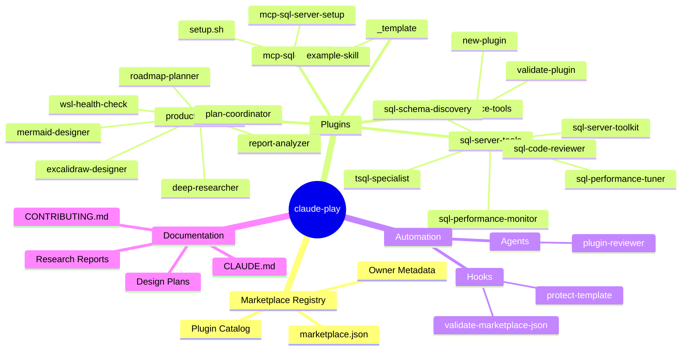
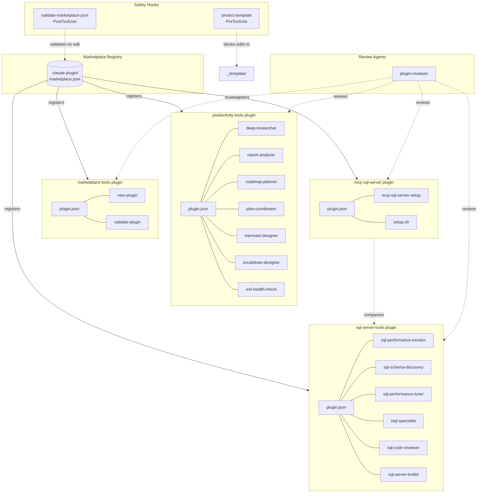
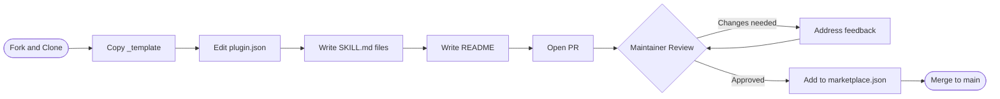
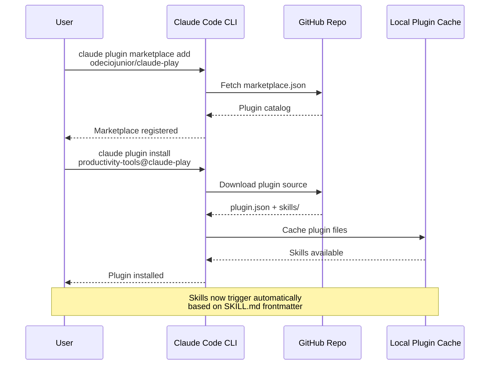
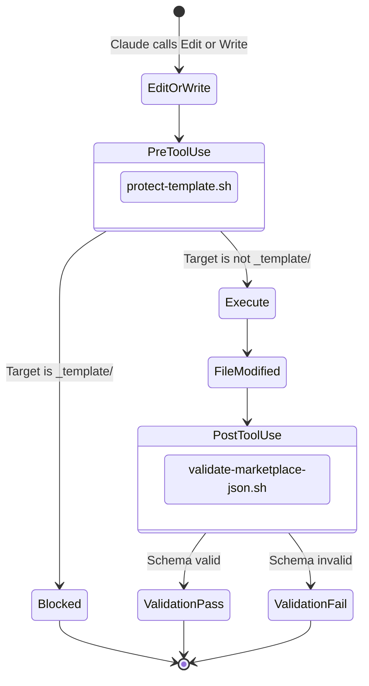

# claude-play Repository Architecture

## 1. Repository Structure Overview

**Description:** The claude-play repository is a community-driven Claude Code plugin marketplace. At its core is a marketplace registry (`marketplace.json`) that catalogs installable plugins. Four plugins ship with the repo: `productivity-tools` (7 skills for research, analysis, planning, and diagramming), `marketplace-tools` (2 skills for scaffolding and validation), `sql-server-tools` (5 specialized agents + 1 routing skill for SQL Server work), and `mcp-sql-server` (setup skill + bash script for automated MCP server installation). Automation hooks protect the template directory and validate the marketplace catalog on every edit. A `plugin-reviewer` agent provides 3-phase quality reviews. The `_template` directory gives contributors a starting point for new plugins.

---

## 2. Plugin System Architecture

**Description:** The marketplace registry (`marketplace.json`) is the central catalog that registers all four plugins. Each plugin has a `plugin.json` manifest and skill/agent definitions. `sql-server-tools` provides 5 specialized agents routed by a single skill, while `mcp-sql-server` uses a setup skill that orchestrates a bash script for MCP server installation — the two plugins are companions (mcp-sql-server provides database connectivity, sql-server-tools provides expert agents that use it). Two hooks enforce quality: `protect-template` (PreToolUse) prevents modifications to the contributor template, and `validate-marketplace-json` (PostToolUse) validates the catalog schema after every edit. The `plugin-reviewer` agent can perform structured reviews on any plugin.

---

## 3. Contributor Workflow

**Description:** Contributors fork the repo, copy the `_template` directory, customize the plugin manifest and skill files, write documentation, and open a pull request. A maintainer reviews the PR (potentially aided by the `plugin-reviewer` agent). If changes are needed, the contributor iterates. Once approved, the maintainer registers the plugin in `marketplace.json` and merges.

---

## 4. User Installation Flow

**Description:** Users first register the marketplace by pointing Claude Code CLI at the GitHub repo. The CLI fetches `marketplace.json` to learn what plugins are available. When a user installs a specific plugin, the CLI downloads the plugin source (manifest and skill files), caches them locally, and makes the skills available. From that point, skills trigger automatically based on the `description` field in each SKILL.md frontmatter.

---

## 5. Hook Execution Flow

**Description:** When Claude Code attempts an Edit or Write operation, two hooks fire. First, the `protect-template` PreToolUse hook checks if the target is inside `_template/` and blocks the operation if so. If allowed, the file is modified, then the `validate-marketplace-json` PostToolUse hook runs to validate the marketplace catalog schema. This ensures the template stays pristine and the catalog remains well-formed.
